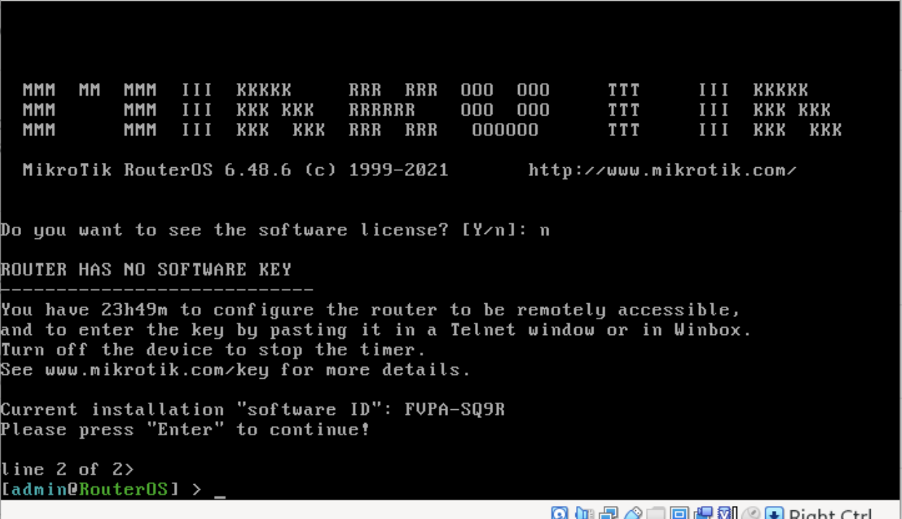
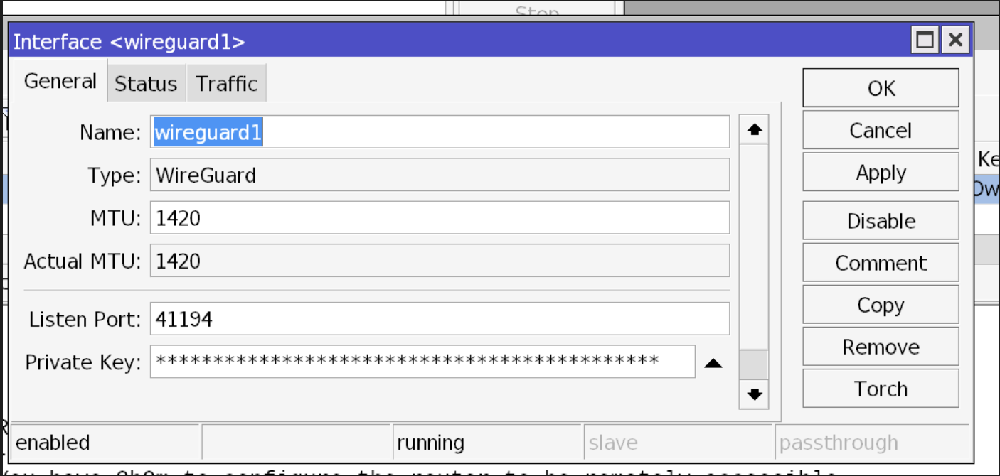
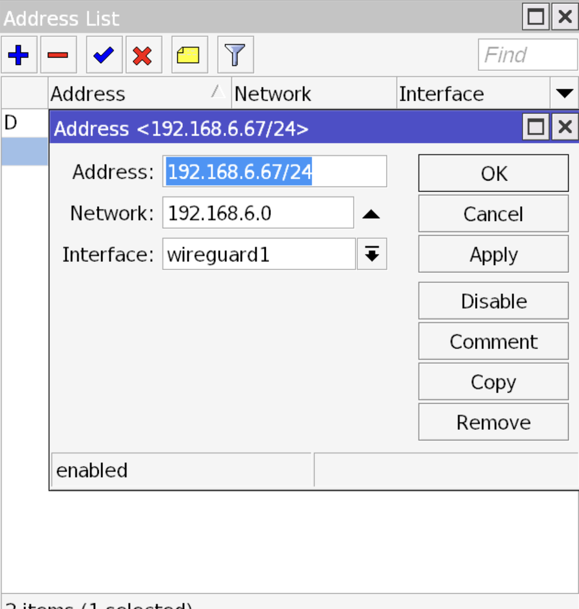
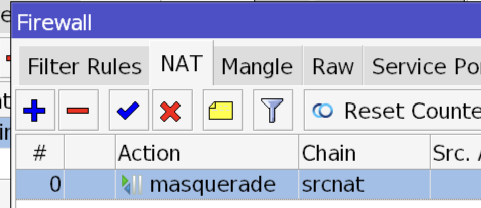
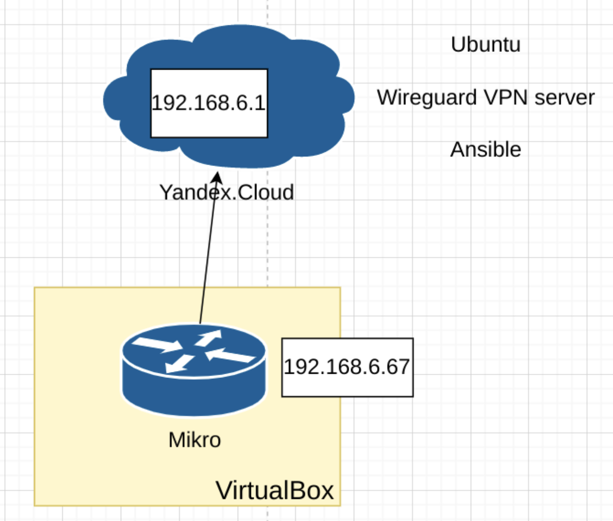

University: [ITMO University](https://itmo.ru/ru/)

Faculty: [FICT](https://fict.itmo.ru)

Course: [Network programming](https://github.com/itmo-ict-faculty/network-programming)

Year: 2023

Group: K34212

Author: Glebov Ivan Igorevich

Lab: Lab1

Date of create: 01.12.2023

Date of finished: 01.12.2024

Тема работы: Установка CHR и Ansible, настройка VPN

Цель работы: развертывание виртуальной машины с установленной системой контроля конфигураций Ansible и установка CHR в VirtualBox

Ход работы:
1. Создаём виртуальную машину в Яндекс.Облаке на операционной системе Ubuntu.

2. Подключаемся к ней по ssh, устанавливаем ansible.
3. В VirtualBox устанавливаем MikroTik 7 версии, это будет важно для дальнейшей работы. Здесь имеет смысл обратить внимание на то, что после загрузки в настройках VirtualBox необходимо отключить загрузочный диск вручную, тогда как на установке более привычных операционных систем это происходит автоматически.

4. После этого устанавливаем Wireguard на удалённую машину, прописываем в нём в файл условий интерфейса. Создаём пару ключей.

5. После этого начинаем работу с MikroTik. Было обнаружено, что большая часть инструкций по его использованию объясняют работу при помощи графического интерфейса WinBox. Работа в консоли тоже возможна, но создала впечатление более затруднительной, по этой причине было решено установить графический интерфейс.

6. Графический интерфейс работает только на Windows, поэтому для подключения использовался десктоп с win10. С него водключение к виртуалке не вызвало проблем.

7. Поскольку в качестве VPN был выбран WireGuard, и установлен MikroTik последней версии, заходим в настройку Wireguard и создаём там новый интерфейс.
8. Заполним соответствующие поля: MTU 1420, ListenPort узнаём командой вывода файла /etc/wireguard/wg0.conf на сервере, ключи будут сгененрированы автоматически.

9. Переходим во вторую вкладку, там создаём Peer - указываем только что созданный интерфейс, указываем публичный ключ сервера, его публичный IP, указанный ранее порт и сеть адресов, по которым будет идти подключение.

10. В настройке IP - Addresses указываем выбранную сеть и созданный интерфейс.

11. В настройке IP - Firewall создаём NAT Rule masquerade, Masquerade NAT позволяет преобразовывать несколько IP-адресов в другой одиночный IP-адрес. Можно использовать маскарадный NAT, чтобы скрыть один или несколько IP-адресов во внутренней сети за IP-адресом, который нужно сделать общедоступным. 

12. Теперь для проверки работоспособности запускаем ping к виртуальной машине по заданному IP адресу. Пинг идёт - следовательно, все настройки выполнены корректно.

13. В результате получаем связь по следующей схеме.

Выводы: При помощи WireGuard возможно настроить VPN туннель между виртуальной машиной с операционной системой RouterOS и удалённой виртуальной машиной. Для работы с RouterOS достаточно удобно использовать графический интерфейс. Сложности в работе вызывает только использование ssh ключей, тк в них можно запутаться и доступ прекратит своё существование.
