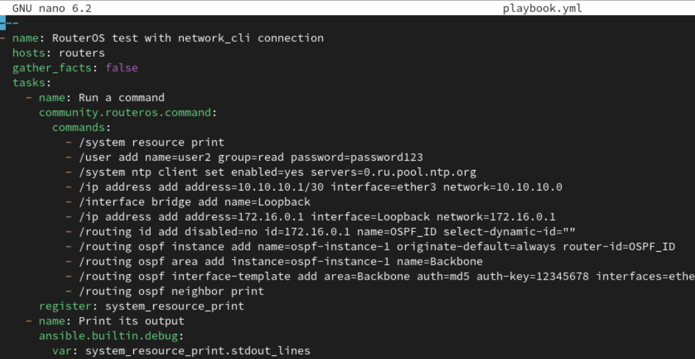
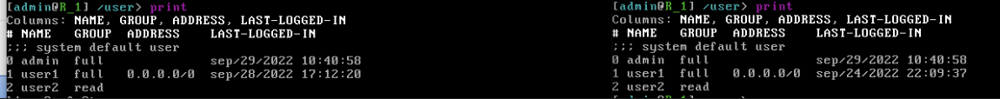

University: ITMO University

Faculty: FICT

Course: Network programming

Year: 2023

Group: K34212

Author: Glebov Ivan Igorevich

Lab: Lab2

Date of create: 01.12.2023

Date of finished: 01.12.2023

Тема работы: Развертывание дополнительного CHR, первый сценарий Ansible

Цель работы: С помощью Ansible настроить несколько сетевых устройств и собрать информацию о них. Правильно собрать файл Inventory.

Ход работы:
1. Начинаем работу с Ansible. Для этого создаём файл hosts.ini, в котором указываем конфигурацию нашего RouterOS. В данном случае это его IP, логин и пароль.
2. Создаём первый playbook, в котором указываем команду вывода информации о системе в консоль. Это нужно для проверки того, что ansible работает.
3. Поскольку в данном способе решения лабораторных работ используется WireGuard, то нужно для начала запустить подключение со стороны клиента. Понятно, что в реальных системах этот способ не очень удобен, в крайнем случае можно попробовать автоматизировать эту настройку, чтобы клиент автоматически через одинаковые промежутки времени отправлял пинг в сторону сервера. Но на данный момент это делается вручную.
4. После этого на удалённой машине запускаем команду ansible-playbook playbook.yml -i ./hosts.ini
5. В выводе есть информация о нашем виртуальном роутере, следовательно, всё работает корректно.

7. Создаём виртуальную машину Mikro2. Проделываем все описанные в первой лаборатоной пункты, в итоге обе машины настроены как Wireguard клиенты, в моём случае первая машина - 192.168.6.67, вторая - 192.168.6.68. 

8. Далее прописываем все необходимые по задаче команды. Это создание нового пользователя с логином и паролем, изменение указанного времени и настройка OSPF сети. 

9. Запускаем ansible, смотрим на вывод результатов команды. В моём случае все указанные команды уже были выполнены аналогичным способом ранее, поэтому вывод состоит в основном из "already exists". 

10. Проверим, что всё действительно было создано. В первую очередь, пользователи.

11. Проверим установленное время. Информация о его изменении сама автоматически высветилась в консоли.

12. И, наконец, проверим OSPF. В случае корректной работоспособности роутеры будут видеть друг друга как Neighbors.

13. Теперь необходимо собрать полный конфиг устройства со всеми настройками. Сдлеать это удобно через команду export. Сохраняем файл на хосте. Можно также сохранить только часть конфига - в нашем случае это OSPF.

14. Посмотрим, как выглядит всё, что было создано, на диаграмме.

Выводы: Ansible удобен для удалённой работы сразу с несколькими роутерами, в случае если им необхожимо настроить одинаковые конфигурации.

