University: ITMO University

Faculty: FICT

Course: Network programming

Year: 2023

Group: K34212

Author: Glebov Ivan Igorevich

Lab: Lab3

Date of create: 01.12.2023

Date of finished: 01.12.2023

Ход работы:

1. Поднимаем Ubuntu 20.04 на виртуальной машине на хосте. Она будет предназначена для NetBox. Соединяем её с виртуальной машиной в облаке Яндекса, используя Wireguard по аналогии с первой лабораторной работой. Проверяем, что связь есть (192.168.6.1 - IP адрес виртуальной машины в Яндексе)
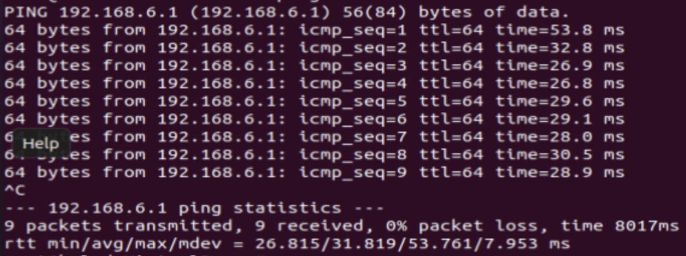

2. Запускаем Netbox. Это требует установки большого количества зависимостей. Далее первый этап - это установка и настройка postgresql. Создаем базу данных Netbox с одноимённым пользователем, запускаем. Проверяем, что всё работает корректно.
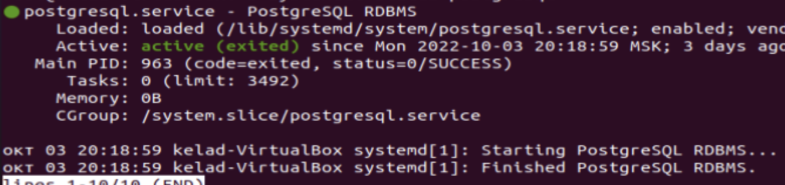
3. После этого настраиваем nginx, добавляем туда информацию о Netbox. Поскольку всё будет разворачиваться локально, указываем локалхост в конфигурационном файле. После этого можно запустить сам Netbox и проверить, что он запускается корректно.
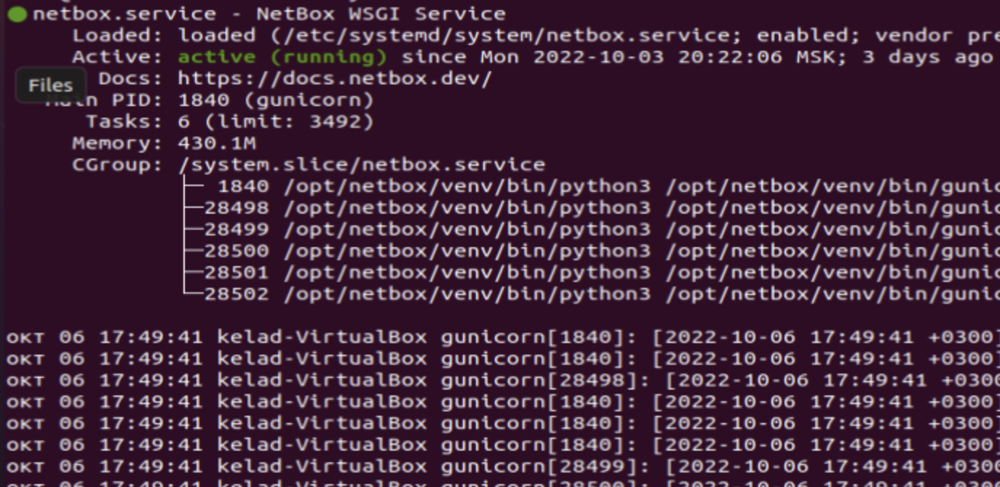
4. Далее в браузере открываем ссылку на netbox и видим главную страницу.
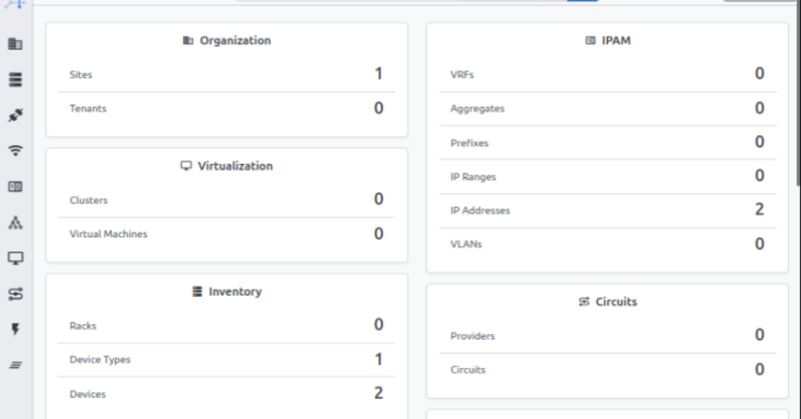
5. Изначально там нет никакой информации, мы вносим два наших роутера. В моём случае занесены Сайт и сопутствующая информация для того, чтобы можно было добавить роутер.
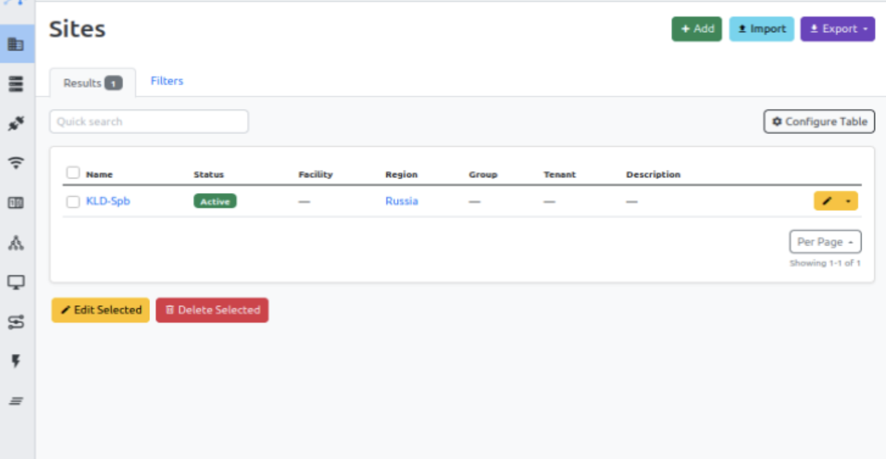

6. Далее вносим роутеры и информацию о них. На скриншоте также присутствует IP адрес, но по факту он будет внесён позднее.
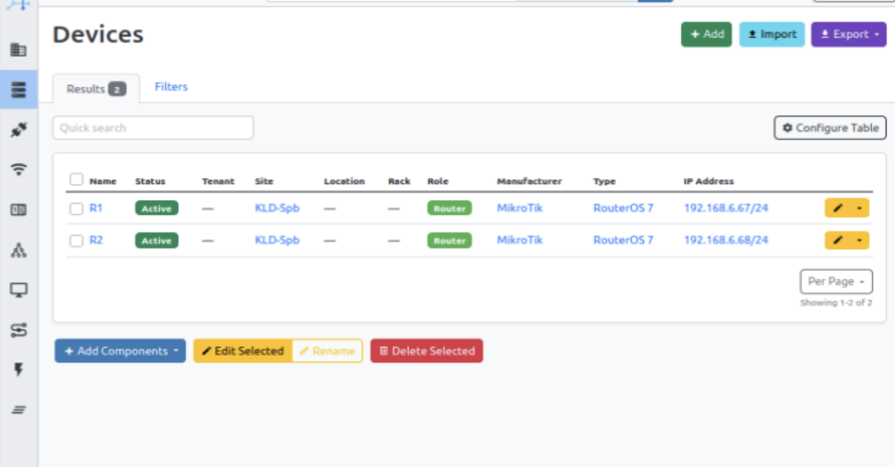

7. Для внесения IP адреса требуется создать интерфейс на роутере. Таким образом, в Netbox записаны два роутера, их ID, названия, интерфейсы и IP адреса.

8. Сохраняем всю эту информацию в формате csv. Файл присутствует в этой папке.
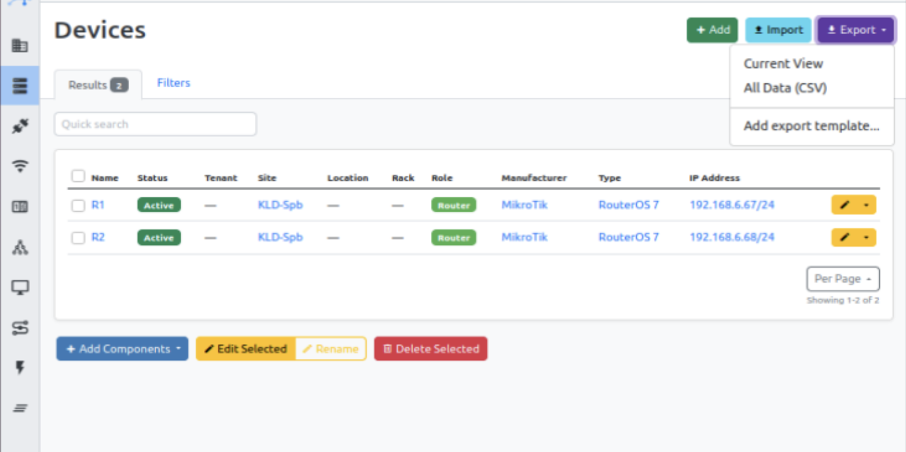
9. Подключаемся по ssh с виртуальной машины Ubuntu на облачную машину и при помощи команды scp передаём этот файл в облачную машину. Он потребуется нам для работы с Ansible.
10. Начинаем работу над плейбуком. В папке он представлен в итоговом виде, во время работы я разделила основную цель на две подзадачи. Первая - спарсить csv файл и записать нужную нам информацию о роутере в отдельный файл. В данном случае за ключ берём UID роутера, так как это значение не будет изменяться. 
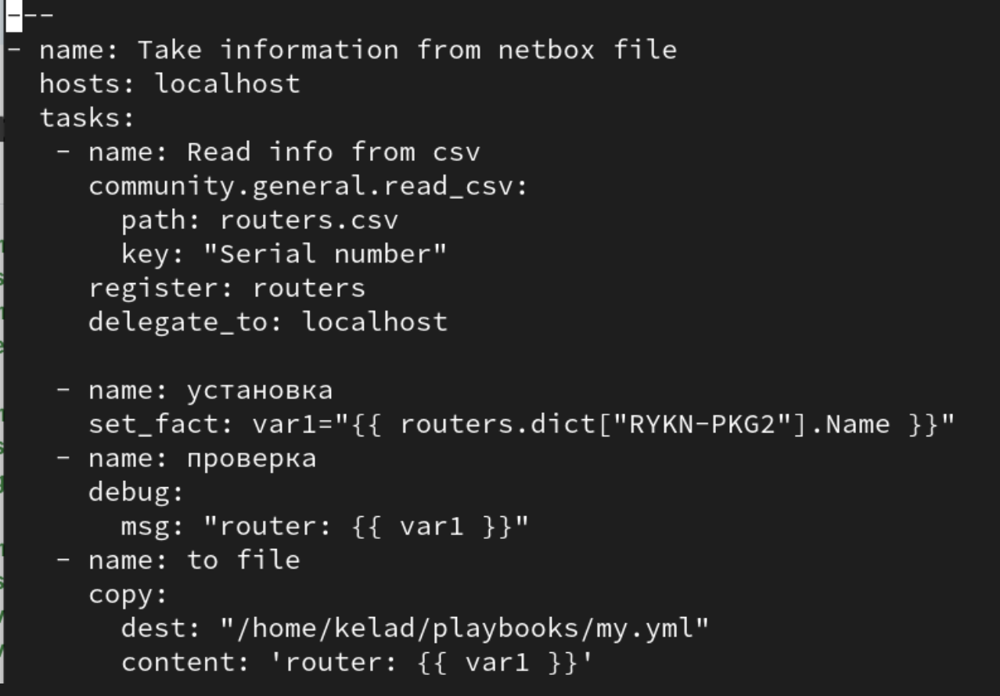
 11. Запускаем, чтобы проверить правильность вывода. 
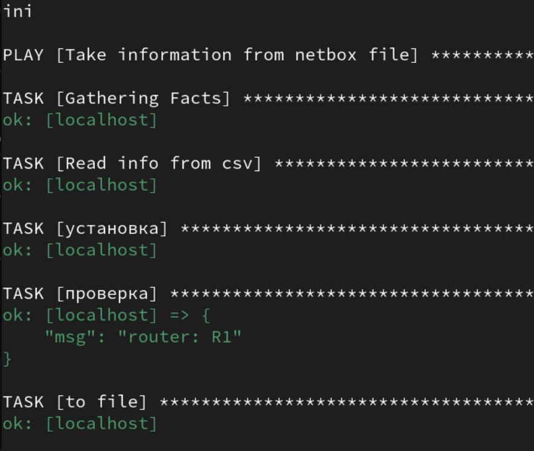
12. Теперь дописываем часть, связанную с установкой названия роутера. 
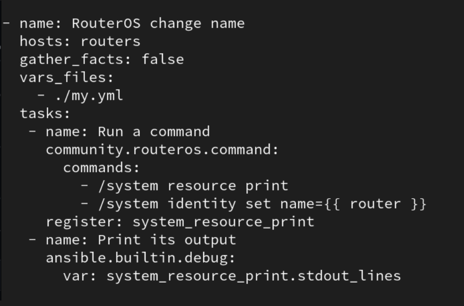

13. И запускаем весь плейбук целиком, в результате чего он берёт имя роутера из csv файла, сгенерированного Netbox, и присваивает это имя подключенному роутеру. Вывод результатов показывает, что всё работает корректно.
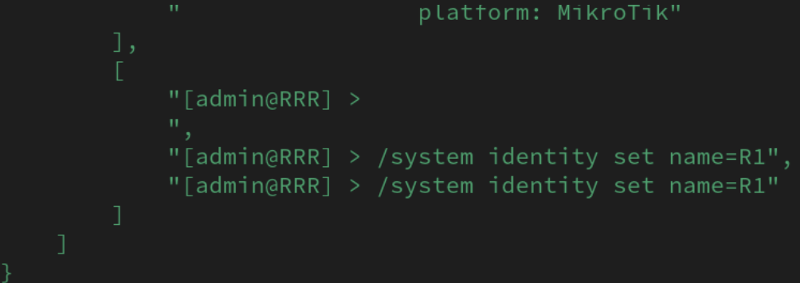
14. В консоли Микротика видим, что имя роутера изменилось.
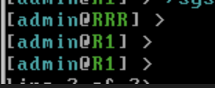
15. Теперь работаем над обратной задачей - необходимо информацию из роутера передать в Netbox. Для начала пишем просто скрипт создания девайся в Netbox.
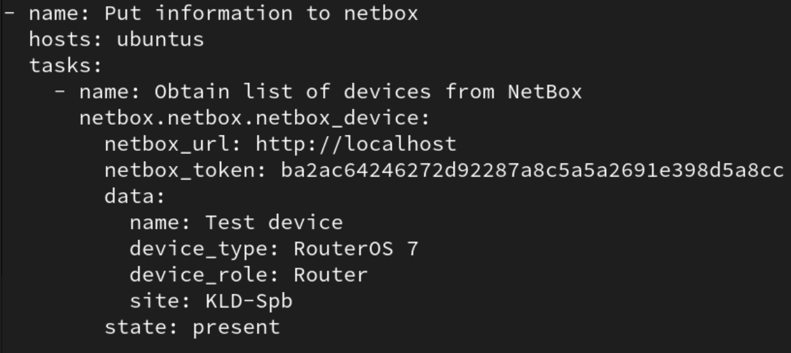

16. Заходим в Netbox и проверяем, что он сработал.
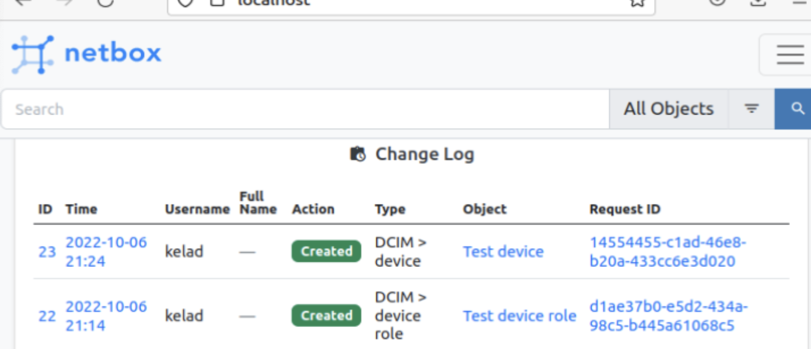

17. Далее реализуем ту часть задания, в которой информация достаётся из Микротика и передаётся в файл на виртуальной машине в облаке.
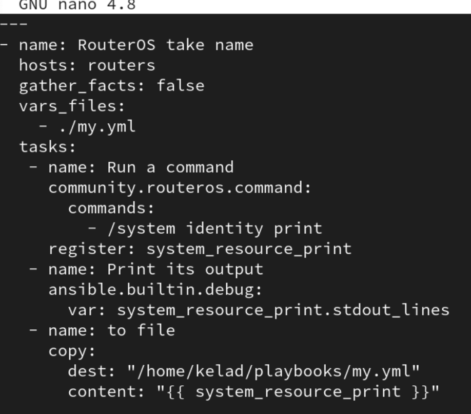
18. И теперь вносим эту информацию в Netbox. В моём случае создаётся девайс, в котором часть настроек предопределено, а имя используется то, которое было взято из Микротика.
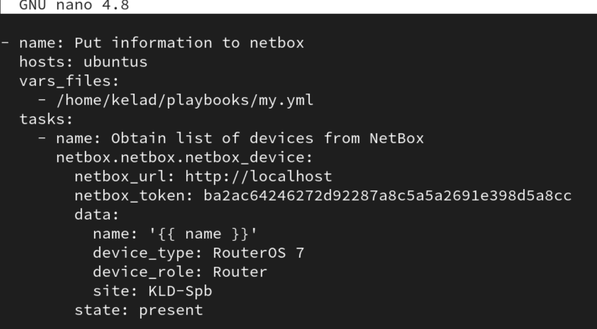
19. Запускаем итоговый файл, видим корректный вывод от ansible.
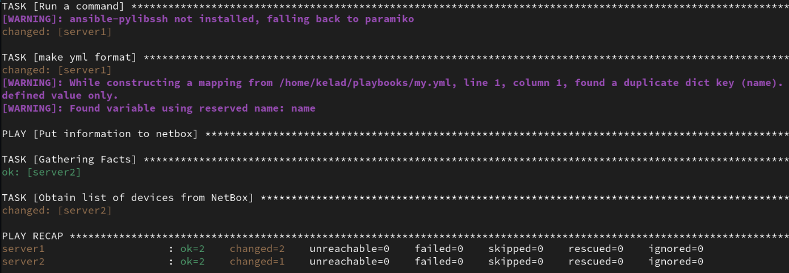

20. Заходим в Netbox и проверяем, сохранились ли изменения. Есть информация о добавлении R1 - следовательно, задача выполнена.
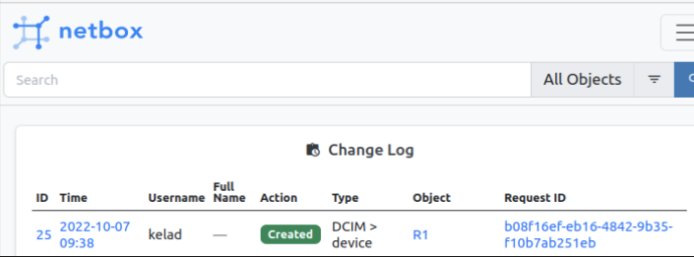

Выводы: Мы познакомились с довольно интересным и очень гибким инструментом для документирования сетей - Netbox. Также узнали, насколько многофункционален ansible, так как с его помощью можно довольно просто решать сложные и долгие задачи, автоматизируя весь процесс.

